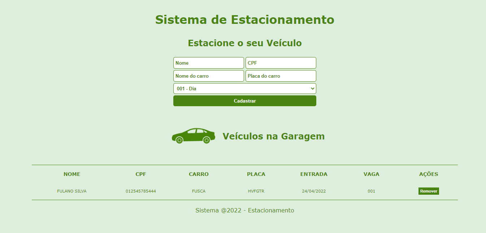

# Projeto Estacionamento

#### Link do Projeto: <a href="https://github.com/rjsmatos10/estacionamento-ts">Abrir Estacionamento Typescript</a>

## Promovido pela Digital Innovation One - DIO

### Sobre o Projeto

##### O projeto Estacionamento foi criado pela DIO para o treinamento do Typescript.

##### Desenvolvi na linguagem Typescript o funcionamento do Estacionamento usando funções, interfaces, objetos, tipos e muito mais. 

##### Desenvolvi também não só a codificação, mas também o layaut do sistema, usando o que é de mais moderno nas tecnologias.

##### O objetivo desse sitema é cadastrar os dados necessários para compor o Estacionamento, sendo salvo no Local Storage do navegador e sendo listado na tela. Caso o usuário finalize sua permanência no estacionamento é só removê-lo do cadastro clicando no botão remover.

### Layout do Projeto

### Tecnologias Utilizadas

* HTML5
* CSS3
* Javascript
* Typescript
